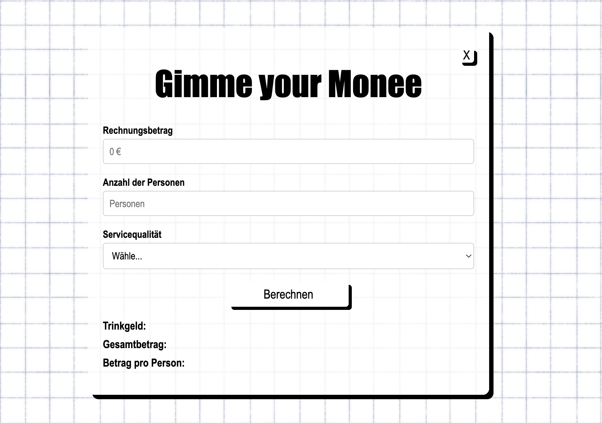
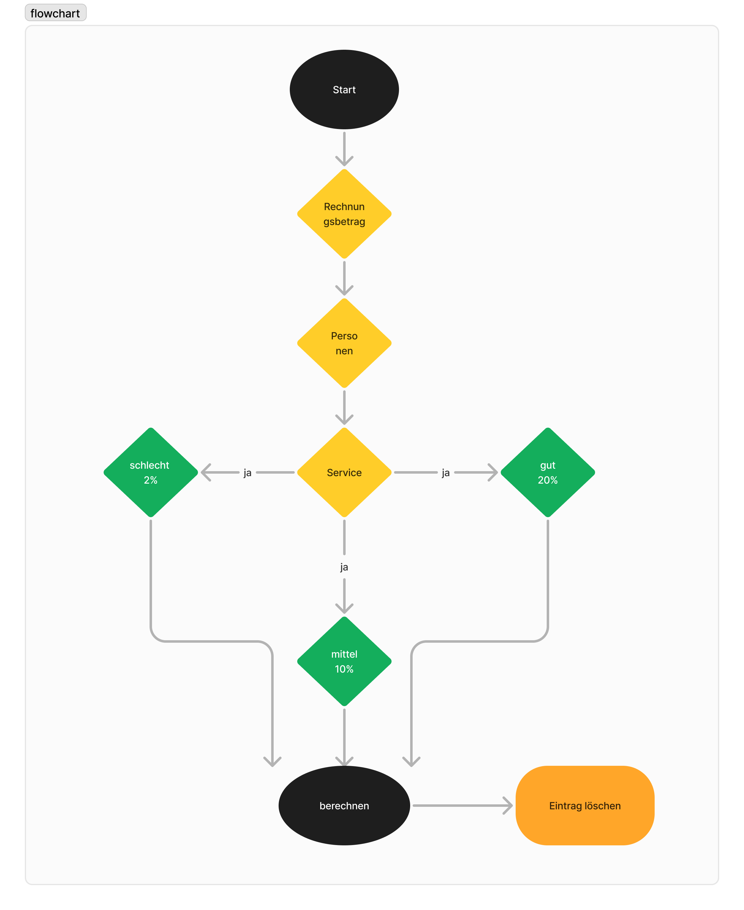
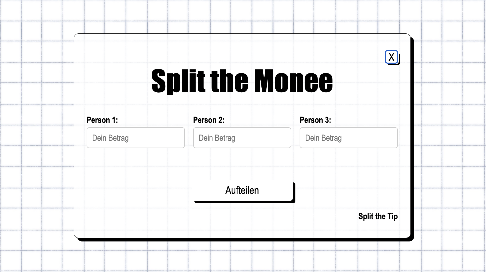

# Trinkgeldrechner

## Beschreibung

Die Aufgabe bestand darin, einen **Trinkgeldrechner** zu erstellen, der dabei hilft, die Gesamtkosten einer Rechnung inklusive Trinkgeld zu berechnen. 
Du kannst: 

- Den Betrag auf mehrere Personen aufteilen.
- Je nach Servicequalität das Trinkgeld anpassen.

Das Projekt wurde mit **TypeScript** entwickelt und mit **HTML** und **CSS** gestaltet.

## Projekt




## Features ✨

- **Eingabe des Rechnungsbetrags**: Gib den Gesamtbetrag der Rechnung ein.
- **Anzahl der Personen**: Teile den Betrag auf mehrere Personen auf.
- **Trinkgeldberechnung**: Wähle die Servicequalität:
  - **Schlechter Service**: 2 % Trinkgeld
  - **Guter Service**: 10 % Trinkgeld
  - **Hervorragender Service**: 20 % Trinkgeld
- **Ergebnisse mit Aufschlüsselung**:
  - Trinkgeldbetrag
  - Gesamtkosten (Rechnung + Trinkgeld)
  - Betrag pro Person

- **Reset-Funktion**: Lösche alle Eingaben und starte neu.

## Aufbau 📋

### HTML-Struktur
Die Benutzeroberfläche besteht aus:
- **Eingabefeldern**:
  - Rechnungsbetrag
  - Anzahl der Personen
  - Servicequalität (Dropdown-Menü)
- Einem **"Berechnen"-Button**, um die Ergebnisse anzuzeigen
- Einem **"Löschen"-Button**, um die Eingaben zurückzusetzen
- **Ergebnisfelder**:
  - Trinkgeldbetrag
  - Gesamtkosten
  - Betrag pro Person

### TypeScript-Logik
- Dynamische Berechnung:
  - Trinkgeldbetrag basierend auf dem Prozentsatz der Servicequalität
  - Gesamtkosten (Rechnungsbetrag + Trinkgeld)
  - Aufteilung der Kosten auf die Anzahl der Personen
- Dynamische Anzeige der Ergebnisse im Ergebnisbereich

## Flowchart



------------

# Split Calculator 💰

Ein kleiner **Split Calculator**, der hilft, die Ausgaben zwischen mehreren Personen fair aufzuteilen. 



## Features ✨

- **Eingabe für mehrere Personen**: Gib an, wie viel jede Person bezahlt hat.
- **Automatische Berechnung**:
  - Gesamtausgaben
  - Durchschnittliche Ausgaben pro Person
  - Differenz pro Person (zu zahlen oder zurückzubekommen)
- **Ergebnisse mit Farben**:
  - Grün: Guthaben (zu viel gezahlt)
  - Rot: Schulden (zu wenig gezahlt)
- **Reset-Funktion**: Lösche alle Eingaben und starte neu.

## Aufbau 📋

### HTML-Struktur
Die Benutzeroberfläche besteht aus:
- **Eingabefelder** für drei Personen
- Einem **"Berechnen"-Button**, um die Ergebnisse anzuzeigen
- Einem **"Löschen"-Button**, um die Eingaben zurückzusetzen
- **Ergebnisfelder** für jede Person:
  - Angezeigter Betrag
  - Differenz (Guthaben oder Schulden)

### TypeScript-Logik
- Dynamische Berechnung:
  - Gesamtsumme der Eingaben
  - Durchschnittliche Ausgaben pro Person
  - Differenz zwischen den tatsächlichen Ausgaben und dem Durchschnitt
- Dynamisches Styling:
  - **Guthaben** werden grün markiert
  - **Schulden** werden rot markiert

## Installation 🔧

1. **Projekt klonen**:
   ```bash
   git clone <repository-url> .

